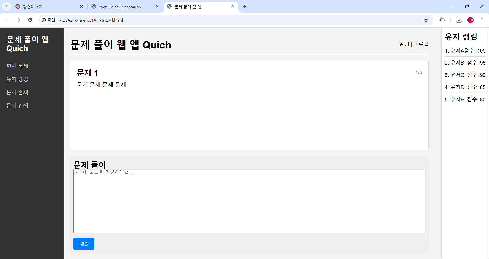

# Team14-Project
## 제목
Quich (quiz each other)

## 요약
이 사이트는 서로 퀴즈를 내고 풀 수 있는 사이트이다. 중고등학생의 경우 공부하는 과목에 대해 수많은 문제가 시중에 나와있지만, 
대학생들의 경우 전공 혹은 교양 과목에 상관없이 시중에 교재 이외의 문제가 없는 경우가 많다. 그러나 이 사이트는 배우는 학생들이나 
문제를 내는 사람들 모두 자신의 지식을 공유하거나 확인하기 위해 다른 사람들의 생각이 담긴 문제를 볼 수 있다. 따라서 
대학생의 경우에도 자신이 공부한 내용이나 문제를 서로 공유하며 예시문제가 많이 없는 공부에서도 학습 효율을 높일 수 있다.

또한 자신이 원하는 문제를 검색해서 찾을 수 있고, 문제를 풀면 풀수록 순위가 올라서 문제를 푸는 것만이 아닌 다른 재미도 느낄 수 있다.

## 프로젝트를 간단히 나타내는 하나 이상의 이미지

## 프로젝트 일정
### ~11.17
프로젝트 사이트 및 디자인 구상
### ~11.24
퀴즈 로직과 사용자 상호작용 및 결과관리 부분 구현
### ~12.8   
문제들의 데이터 베이스 구현 후 병합
### ~12.15
전체적으로 다듬기 및 마무리

## 팀 역할 및 개발 분야
- 김찬희: 프로젝트 사이트 디자인
- 권관호: 문제 데이터베이스 구현
- 백준영: 결과관리 파트 구현
- 이연우: 문제풀이 파트 구현

## 프로젝트 실행에 필요한 기술 목록 
HTML/CSS, JavaScript, Node.js, GitHub Pages